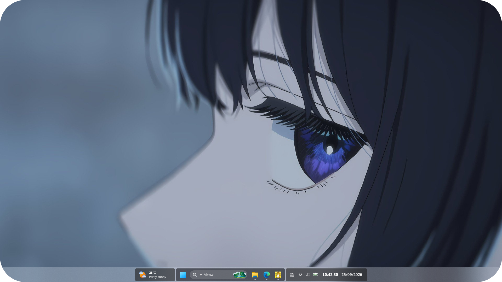
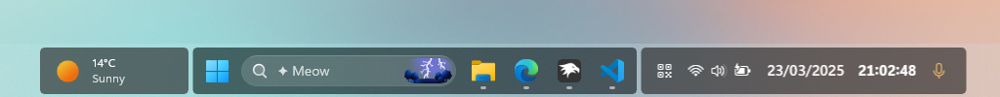
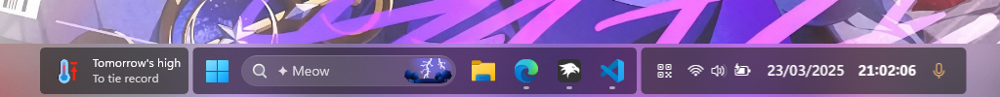
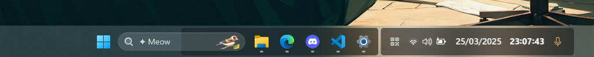
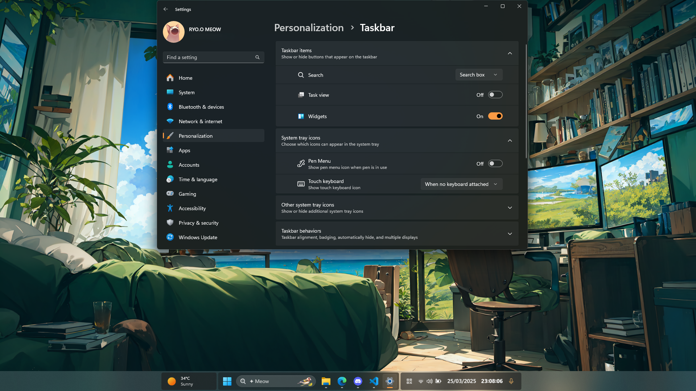

# ✦ TaskbarXII theme for Windows 11 Taskbar Styler :3

**Author**: [ryokr](https://github.com/ryokr)

 \


## Notes

- If you notice the background is missing under the window button, it means the `Widget` feature is disabled.

  

  To fix this, either enable the `Widget` feature, or add the following styles to the mod's settings:

```
Target:
Taskbar.TaskbarBackground#BackgroundControl

Styles:
Height=48
Transform3D:=<CompositeTransform3D TranslateX="0"/>
Opacity=0.7
```
This will override the default value of TranslateX="156.5"

  

## Suggested Windows settings

- Use default taskbar alignment (center).
- The widget should be enabled.
- You can hide the bell icon via Notifications in Settings.

## Theme selection

The theme is integrated into the Window 11 Taskbar Styler, and can be simply selected from the mod's
settings:

* Open the Windows 11 Taskbar Styler mod in Windhawk.
* Go to the "Settings" tab.
* Select the theme and save the settings.

## Manual installation

The theme styles can also be imported manually. To do that, follow these steps:

* Enable the Developer mode in Windhawk.
* Click *Create a New Mod* button.
* Copy the content in [TaskbarXII](https://raw.githubusercontent.com/ryokr/TaskbarXII/refs/heads/main/TaskbarXII.cpp).
* Replace all ccontent in Windhawk editor with this.
* Then click *Compile Mod* Button.
